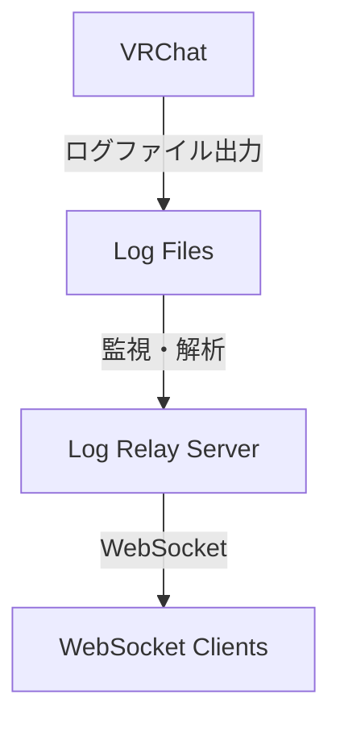

# VRChat Log Relay Server

VRChatのログファイルをリアルタイムで監視し、WebSocketを通じて外部アプリケーションにログ情報を中継するNode.js製サーバーアプリケーションです。

## 概要

本ツールは、ローカルで実行されているVRChatのログ出力を監視し、その内容を整形してWebSocket経由で配信します。これにより、VRChatの内部で起きているイベント（プレイヤーの出入り、ワールド情報など）を、外部のアプリケーション（配信ツール、統計ツール、自作デバイスなど）でリアルタイムに利用することが可能になります。

## 主な機能

- **VRChatプロセスの自動監視**
  - VRChatの起動と終了を自動的に検知し、ログ監視を開始・停止します。

- **リアルタイムログ監視**
  - VRChatが出力するログファイル (`output_log_*.txt`) の変更をリアルタイムに検知します。
  - 複数のログファイルをインテリジェントに選択・監視する機能は、[Narazaka氏作のvrc-tail](https://github.com/Narazaka/vrc-tail)のアルゴリズムを参考に実装されています。

- **WebSocketによるデータ配信**
  - 監視したログデータを整形し、接続されているクライアントへリアルタイムに配信します。
  - サーバーの状態（VRChatの起動/終了など）も通知します。

- **WebクライアントUI**
  - サーバーに接続し、配信されるログをリアルタイムで表示・フィルタリングできるWebベースのクライアント画面を提供します。
  - `http://localhost:3000` にアクセスすることで利用できます。

- **詳細な設定**
  - `config`ディレクトリ内のYAMLファイルで、サーバーのポート、ログ監視の方法、プロセス監視の挙動などを細かく設定できます。

## システム構成図



## インストールと実行方法

### 前提条件

- Node.js v20.x 以上
- Windows 10/11

### 手順

1.  **リポジトリをクローン**
    ```bash
    git clone https://github.com/your-username/vrc-log-relay-server.git
    cd vrc-log-relay-server
    ```

2.  **依存関係をインストール**
    ```bash
    npm install
    ```

3.  **開発モードで起動**
    - ソースコードの変更を検知して自動的に再起動します。
    ```bash
    npm run dev
    ```

4.  **本番用にビルドして起動**
    ```bash
    # TypeScriptをJavaScriptにビルド
    npm run build

    # ビルドされたコードを実行
    npm start
    ```

サーバーが起動したら、Webブラウザで `http://localhost:3000` にアクセスすると、WebクライアントUIが表示されます。

## コマンドラインオプション

`npm start` または `node dist/index.js` の実行時に、以下のオプションを指定できます。

| オプション                | 説明                                           | デフォルト値        |
| ------------------------- | ---------------------------------------------- | ------------------- |
| `-e, --env <environment>` | 実行環境 (`development`, `production`)         | `development`       |
| `-c, --config <dir>`      | 設定ファイルが格納されているディレクトリ       | `./config`          |
| `-p, --port <port>`       | HTTPサーバーのポート番号                       | 設定ファイルの値    |
| `-h, --host <host>`       | サーバーがバインドするホストアドレス           | 設定ファイルの値    |
| `-l, --log-level <level>` | ログレベル (`error`, `warn`, `info`, `debug`)  | `info`              |
| `--help`                  | ヘルプメッセージを表示                         | -                   |

**例:**
```bash
# 本番環境として起動
npm start -- --env production

# ポート番号を9000番に変更して起動
npm start -- --port 9000
```

## 設定

設定は `config` ディレクトリ内のYAMLファイルで行います。

-   `default.yaml`: 全ての環境に適用される基本設定です。
-   `development.yaml`: 開発環境 (`npm run dev`) での実行時に適用されます。
-   `production.yaml`: 本番環境 (`npm start`) での実行時に適用されます。
-   `local.yaml`: どの環境でも最優先で適用されるローカル設定です。Gitの追跡対象外なので、個人用の設定に使用します。（このファイルは自身で作成する必要があります）

### 主要な設定項目 (`config/default.yaml`)

| キー                               | 説明                                                                 |
| ---------------------------------- | -------------------------------------------------------------------- |
| `server.port`                      | HTTPサーバー（WebクライアントUI）が使用するポート番号。                |
| `server.host`                      | サーバーが待ち受けるホストアドレス。`127.0.0.1`はローカル専用。      |
| `websocket.port`                   | WebSocket通信が使用するポート番号。                                  |
| `vrchat.logDirectory`              | VRChatのログディレクトリのパス。`null`の場合、自動検出を試みます。     |
| `vrchat.monitoring.groupPeriod`    | 関連するログファイルと見なす時間（秒）。VRChat再起動時のログをまとめる。 |
| `vrchat.processMonitoring.enabled` | VRChatプロセスの監視を有効にするか。                                 |
| `logging.level`                    | コンソールに出力されるログの詳細度。                                 |
| `logging.file.enabled`             | ログをファイルに保存するか。                                         |

## プロジェクト構造

```
/
├── config/              # 設定ファイル (YAML)
├── public/              # WebクライアントUIの静的ファイル
├── src/                 # TypeScriptソースコード
│   ├── index.ts         # アプリケーションのエントリーポイント
│   ├── server/          # HTTPサーバー、メインコントローラー
│   ├── log/             # VRChatログの監視、解析ロジック
│   ├── websocket/       # WebSocketサーバー、クライアント接続管理
│   ├── types/           # TypeScriptの型定義
│   └── utils/           # ユーティリティ (ロガーなど)
├── tests/               # テストコード
├── package.json         # プロジェクト定義、依存関係
└── README.md            # このファイル
```

## 開発者向けコマンド

-   `npm test`: 全てのテストを実行します。
-   `npm run test:watch`: ファイル変更を監視してテストを再実行します。
-   `npm run lint`: ESLintでコードの静的解析を実行します。
-   `npm run format`: Prettierでコードをフォーマットします。

## 謝辞

本ツールのログファイル監視機能、特に複数のログファイルから最新のものを選択するロジックは、[Narazaka氏が開発したvrc-tail](https://github.com/Narazaka/vrc-tail)を大いに参考にさせていただきました。素晴らしいツールを公開してくださったことに感謝いたします。

## ライセンス

このプロジェクトはMITライセンスの下で公開されています。