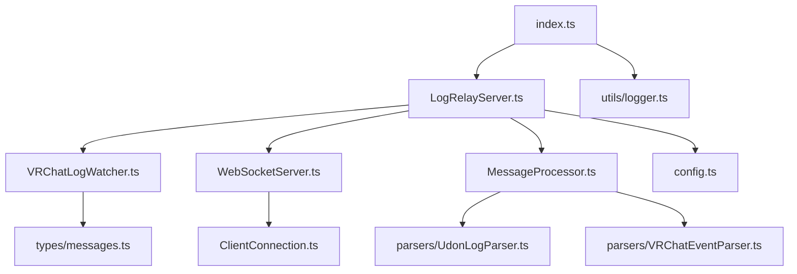

# VRChat Log Relay Server - ファイル構成

## 📁 プロジェクト全体構造

```
vrchat-log-relay-server/
├── 📁 src/                          # TypeScriptソースコード
│   ├── 📄 index.ts                  # アプリケーションエントリーポイント
│   ├── 📁 server/                   # サーバー本体
│   ├── 📁 log/                      # ログ監視・解析
│   ├── 📁 websocket/               # WebSocket関連
│   ├── 📁 web/                     # HTTP API・管理機能
│   ├── 📁 types/                   # TypeScript型定義
│   └── 📁 utils/                   # ユーティリティ
├── 📁 web-ui/                      # 管理Web UI (React)
├── 📁 config/                      # 設定ファイル
├── 📁 tests/                       # テストファイル
├── 📁 docs/                        # 追加ドキュメント
├── 📁 scripts/                     # ビルド・実行スクリプト
├── 📁 project_workflow/            # プロジェクト管理ドキュメント
├── 📄 package.json                 # Node.js依存関係
├── 📄 tsconfig.json               # TypeScript設定
├── 📄 jest.config.js              # テスト設定
└── 📄 README.md                   # プロジェクト説明
```

## 🎯 ディレクトリ別詳細

### `/src` - メインソースコード

#### `/src/server` - サーバーコア
```
server/
├── LogRelayServer.ts        # メインサーバークラス (🔥 最重要)
├── config.ts               # 設定管理クラス
└── healthCheck.ts          # ヘルスチェック機能
```

**LogRelayServer.ts** - 全体の統合・制御を行うメインクラス
- VRChatLogWatcher, WebSocketServer, MessageProcessor の統合
- サーバーライフサイクル管理 (start/stop)
- エラーハンドリングとグレースフルシャットダウン

#### `/src/log` - ログ監視・解析エンジン
```
log/
├── VRChatLogWatcher.ts      # ログファイル監視 (🔥 最重要)
├── MessageProcessor.ts     # ログメッセージ解析
└── parsers/
    ├── UdonLogParser.ts    # Udonログ専用パーサー
    └── VRChatEventParser.ts # VRChatイベントパーサー
```

**VRChatLogWatcher.ts** - ログ監視の中核機能
- VRChatプロセス監視 (wmic使用)
- ログディレクトリ監視 (chokidar使用)
- 複数ログファイル同時監視 (tail使用)
- vrc-tail準拠のアルゴリズム

#### `/src/websocket` - WebSocket通信層
```
websocket/
├── WebSocketServer.ts       # WebSocketサーバー管理
├── ClientConnection.ts     # クライアント接続管理
└── MessageFilter.ts        # メッセージフィルタリング
```

**WebSocketServer.ts** - リアルタイム配信の核
- 複数クライアント接続管理
- メッセージブロードキャスト
- 接続状態監視 (ping/pong)

#### `/src/web` - HTTP API・管理機能
```
web/
├── AdminController.ts       # 管理API制御
└── routes/
    ├── api.ts              # REST API エンドポイント
    └── health.ts           # ヘルスチェックエンドポイント
```

#### `/src/types` - TypeScript型定義
```
types/
├── index.ts                # 基本型のエクスポート
├── config.ts               # 設定関連型
├── messages.ts             # メッセージ・ログ関連型
└── client.ts               # クライアント関連型
```

**重要な型定義:**
- `ProcessedMessage`: 解析済みログメッセージ
- `VRChatStatus`: VRChat実行状態
- `ServerConfig`: サーバー設定
- `ClientConnection`: クライアント接続情報

#### `/src/utils` - ユーティリティ
```
utils/
├── logger.ts               # Winston ログ設定
├── fileUtils.ts           # ファイル操作ヘルパー
└── messageQueue.ts        # メッセージキュー管理
```

### `/web-ui` - 管理WebUI (React)

```
web-ui/
├── src/
│   ├── components/         # React コンポーネント
│   │   ├── Dashboard.tsx   # メインダッシュボード
│   │   ├── ClientList.tsx  # 接続クライアント一覧
│   │   ├── LogViewer.tsx   # ログビューア
│   │   └── StatusPanel.tsx # VRChat状態表示
│   ├── pages/             # ページコンポーネント
│   │   ├── Home.tsx       # ホームページ
│   │   └── Settings.tsx   # 設定ページ
│   ├── hooks/             # カスタムフック
│   │   ├── useWebSocket.ts # WebSocket接続管理
│   │   └── useVRChatStatus.ts # VRChat状態管理
│   ├── App.tsx            # メインアプリ
│   └── main.tsx           # エントリーポイント
├── dist/                  # ビルド出力
├── package.json           # フロントエンド依存関係
└── vite.config.ts         # Vite設定
```

### `/config` - 設定ファイル

```
config/
├── default.yaml           # デフォルト設定
├── development.yaml       # 開発環境設定
└── production.yaml        # 本番環境設定
```

**設定ファイル構造:**
```yaml
server:
  port: 3000
  host: "127.0.0.1"
vrchat:
  logDirectory: null       # 自動検出
  groupPeriod: 30         # 秒
websocket:
  port: 8080
  host: "127.0.0.1" 
logging:
  level: "info"
  file: "logs/server.log"
```

### `/tests` - テストファイル

```
tests/
├── unit/                  # 単体テスト
│   ├── server/
│   ├── log/
│   ├── websocket/
│   └── utils/
├── integration/           # 統合テスト
│   ├── log-watcher.test.ts
│   ├── websocket.test.ts
│   └── end-to-end.test.ts
└── fixtures/              # テストデータ
    ├── sample-logs/
    └── mock-configs/
```

### `/docs` - 追加ドキュメント

```
docs/
├── api.md                 # API リファレンス
├── client-examples/       # クライアント実装例
│   ├── unity-client.cs
│   ├── javascript-client.js
│   └── python-client.py
└── deployment.md          # デプロイ手順
```

### `/scripts` - ビルド・実行スクリプト

```
scripts/
├── build.js              # ビルドスクリプト
├── start.js              # 実行スクリプト
└── package-exe.js        # 実行ファイル化
```

## 📦 重要なファイル詳細

### `src/index.ts` - エントリーポイント
```typescript
// アプリケーション起動の流れ
import { LogRelayServer } from './server/LogRelayServer';
import { loadConfig } from './server/config';

async function main() {
  const config = await loadConfig();
  const server = new LogRelayServer(config);
  
  await server.start();
  
  // グレースフルシャットダウン
  process.on('SIGINT', () => server.stop());
  process.on('SIGTERM', () => server.stop());
}
```

### `package.json` - 依存関係管理
```json
{
  "dependencies": {
    "express": "^4.18.0",      // HTTP サーバー
    "ws": "^8.13.0",           // WebSocket
    "chokidar": "^4.0.0",      // ファイル監視
    "tail": "^2.2.6",          // ログtail
    "winston": "^3.8.0",       // ログ出力
    "dotenv": "^16.0.0",       // 環境変数
    "js-yaml": "^4.1.0"        // YAML設定
  },
  "devDependencies": {
    "typescript": "^5.0.0",
    "@types/node": "^20.0.0",
    "jest": "^29.0.0",
    "eslint": "^8.0.0",
    "prettier": "^3.0.0"
  }
}
```

### `tsconfig.json` - TypeScript設定
```json
{
  "compilerOptions": {
    "target": "ES2022",
    "module": "CommonJS",
    "outDir": "./dist",
    "rootDir": "./src",
    "strict": true,
    "esModuleInterop": true,
    "skipLibCheck": true,
    "resolveJsonModule": true
  },
  "include": ["src/**/*"],
  "exclude": ["node_modules", "dist", "tests"]
}
```

## 🚀 実装優先度

### Phase 1: 基盤機能 (高優先度)
1. **`src/types/`** - 型定義 (最初に実装)
2. **`src/utils/logger.ts`** - ログ機能
3. **`src/server/config.ts`** - 設定管理
4. **`src/log/VRChatLogWatcher.ts`** - ログ監視
5. **`src/log/MessageProcessor.ts`** - メッセージ解析

### Phase 2: 通信機能 (中優先度)
6. **`src/websocket/WebSocketServer.ts`** - WebSocket
7. **`src/websocket/ClientConnection.ts`** - 接続管理
8. **`src/server/LogRelayServer.ts`** - メイン統合
9. **`src/index.ts`** - エントリーポイント

### Phase 3: 管理・UI (低優先度)
10. **`src/web/`** - 管理API
11. **`web-ui/`** - React UI
12. **`tests/`** - テスト実装

## 📝 ファイル依存関係



## 🔧 開発時のファイル作成順序

1. **設定・型定義** から開始
2. **ユーティリティ** を構築
3. **コア機能** を段階的に実装
4. **統合・テスト** で完成

この順序により、依存関係エラーを避けながら段階的に機能を構築できます。
