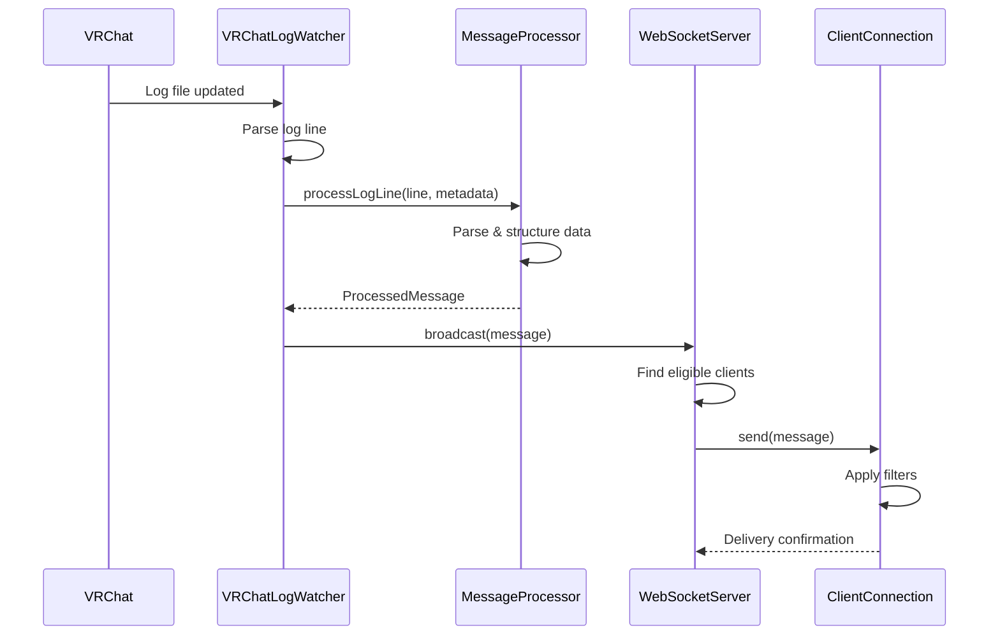

# VRChat Log Relay Server - クラス設計

## 🏗️ システムアーキテクチャ

```
┌─────────────────────────────────────────────────────────────┐
│                    LogRelayServer                           │
│  ┌─────────────────┐ ┌─────────────────┐ ┌───────────────┐  │
│  │ VRChatLogWatcher│ │ MessageProcessor│ │ WebSocketServer│ │
│  └─────────────────┘ └─────────────────┘ └───────────────┘  │
└─────────────────────────────────────────────────────────────┘
```

## 🎯 Core Classes

### 1. LogRelayServer (メインコントローラー)

```typescript
class LogRelayServer {
  private config: ServerConfig;
  private logWatcher: VRChatLogWatcher;
  private wsServer: WebSocketServer;
  private httpServer: Express;
  private messageProcessor: MessageProcessor;
  private isRunning: boolean;
  private logger: Logger;
  
  constructor(config: ServerConfig);
  
  // ライフサイクル管理
  async start(): Promise<void>;
  async stop(): Promise<void>;
  
  // 状態取得
  getMetrics(): ServerMetrics;
  getStatus(): ServerStatus;
  
  // 内部イベントハンドラー
  private onLogMessage(line: string, metadata: LogMetadata): void;
  private onVRChatStatusChange(status: VRChatStatus): void;
  private onWebSocketConnection(client: ClientConnection): void;
  private onWebSocketDisconnection(clientId: string): void;
  
  // 設定・管理
  updateConfig(newConfig: Partial<ServerConfig>): void;
  reloadConfig(): Promise<void>;
}
```

**主要責任:**
- システム全体の統合・制御
- コンポーネント間の連携調整
- ライフサイクル管理（起動・停止）
- エラーハンドリングとロギング

**実装ポイント:**
```typescript
// 起動シーケンス
async start(): Promise<void> {
  this.logger.info('Starting VRChat Log Relay Server');
  
  // 1. HTTP サーバー起動
  await this.startHttpServer();
  
  // 2. WebSocket サーバー起動  
  await this.startWebSocketServer();
  
  // 3. ログ監視開始
  await this.startLogWatcher();
  
  // 4. イベント配線
  this.wireEventHandlers();
  
  this.isRunning = true;
  this.logger.info('Server started successfully');
}

// イベント配線
private wireEventHandlers(): void {
  // ログメッセージの配信パイプライン
  this.logWatcher.on('log_line', (line, metadata) => {
    const processed = this.messageProcessor.processLogLine(line, metadata);
    if (processed) {
      this.wsServer.broadcast(processed);
    }
  });
  
  // VRChat状態変更の配信
  this.logWatcher.on('vrchat_status_change', (statusChange) => {
    this.wsServer.broadcast({
      type: 'vrchat_status_change',
      data: statusChange
    });
  });
}
```

### 2. VRChatLogWatcher (ログ監視エンジン)

```typescript
class VRChatLogWatcher extends EventEmitter {
  private logDirectory: string;
  private watchers: Map<string, Tail>;           // ファイルパス → Tailインスタンス
  private config: WatcherConfig;
  private vrchatStatus: VRChatStatus;
  private processWatcher: NodeJS.Timer;          // プロセス監視タイマー
  private directoryWatcher: chokidar.FSWatcher;  // ディレクトリ監視
  private logger: Logger;
  
  constructor(config: WatcherConfig);
  
  // 監視制御
  startWatching(): Promise<void>;
  stopWatching(): Promise<void>;
  
  // 状態取得
  getVRChatStatus(): VRChatStatus;
  getMonitoredFiles(): string[];
  
  // VRChat プロセス監視
  private async checkVRChatProcess(): Promise<boolean>;
  private startVRChatStatusMonitoring(): void;
  private stopVRChatStatusMonitoring(): void;
  
  // ディレクトリ監視
  private setupDirectoryWatching(): void;
  private onLogDirectoryCreated(dirPath: string): void;
  private onLogDirectoryRemoved(dirPath: string): void;
  
  // ログファイル監視
  private async startLogFileWatching(): Promise<void>;
  private stopLogFileWatching(): void;
  private addLogFile(filePath: string): void;
  private removeLogFile(filePath: string): void;
  private selectTargetFiles(files: FileInfo[]): FileInfo[];
  
  // イベントハンドラー
  private onLogLine(line: string, fileIndex: number): void;
  private onVRChatStatusChange(change: StatusChange): void;
  
  // ユーティリティ
  private parseTimestampFromFilename(filename: string): number;
  private getVRChatLogDirectory(): string;
}
```

**主要責任:**
- VRChatプロセス監視
- ログディレクトリ監視
- 複数ログファイルの同時監視
- vrc-tail準拠のファイル選択アルゴリズム

**核心アルゴリズム実装:**
```typescript
// ファイル選択アルゴリズム（vrc-tail準拠）
private selectTargetFiles(files: FileInfo[]): FileInfo[] {
  const result: FileInfo[] = [];
  let lastTimestamp = 0;
  
  // 時刻でソート（新しい順）
  const sorted = files.sort((a, b) => b.timestamp - a.timestamp);
  
  for (const file of sorted) {
    if (result.length === 0) {
      result.push(file);
      lastTimestamp = file.timestamp;
      continue;
    }
    
    // グループ期間内のファイルのみ追加
    if (lastTimestamp - file.timestamp <= this.config.groupPeriod * 1000) {
      result.unshift(file);  // 時系列順に配置
    } else {
      // 新しいグループ開始 - 古いファイルは破棄
      result.length = 0;
      result.push(file);
      lastTimestamp = file.timestamp;
      this.cleanupOldWatchers();
    }
    
    // 最大4ファイルまで
    if (result.length >= 4) break;
  }
  
  return result;
}

// VRChatプロセス監視
private async checkVRChatProcess(): Promise<boolean> {
  const commands = [
    'wmic process where "name=\'VRChat.exe\'" get ProcessId /format:value',
    'tasklist /FI "IMAGENAME eq VRChat.exe" /NH',
    'wmic process where "commandline like \'%VRChat%\'" get ProcessId /format:value'
  ];
  
  for (const command of commands) {
    try {
      const result = await execAsync(command);
      if (this.hasValidProcessOutput(result.stdout)) {
        return true;
      }
    } catch (error) {
      // 次の方法を試行
      continue;
    }
  }
  
  return false;
}
```

### 3. MessageProcessor (メッセージ解析エンジン)

```typescript
class MessageProcessor {
  private parsers: Map<string, LogParser>;       // パーサー登録
  private filters: LogFilter[];                  // グローバルフィルター
  private logger: Logger;
  
  constructor();
  
  // メイン処理
  processLogLine(line: string, metadata: LogMetadata): ProcessedMessage | null;
  
  // パーサー管理
  addParser(type: string, parser: LogParser): void;
  removeParser(type: string): void;
  getRegisteredParsers(): string[];
  
  // フィルター管理
  addFilter(filter: LogFilter): void;
  removeFilter(filterId: string): void;
  
  // 内部処理
  private parseVRChatLog(line: string): ParsedLogData | null;
  private parseUdonLog(line: string): UdonLogData | null;
  private extractLogLevel(line: string): LogLevel;
  private extractTimestamp(line: string): string | null;
  private buildProcessedMessage(
    line: string, 
    parsed: ParsedLogData | null, 
    metadata: LogMetadata
  ): ProcessedMessage;
  
  // ユーティリティ
  private generateMessageId(): string;
  private shouldSkipMessage(message: ProcessedMessage): boolean;
}
```

**主要責任:**
- ログ行の解析とパース
- 構造化データへの変換
- メッセージタイプの分類
- プラグイン可能なパーサーシステム

**パーサー実装例:**
```typescript
// UdonLogParser の実装
class UdonLogParser implements LogParser {
  private patterns = [
    {
      // "ObjectName: EventType - Data"
      regex: /^\[UdonBehaviour\]\s*(.+?):\s*(.+?)\s*-\s*(.+)$/,
      handler: this.parseObjectEvent.bind(this)
    },
    {
      // "ObjectName.MethodName(params)"
      regex: /^\[UdonBehaviour\]\s*(.+?)\.(.+?)\((.+?)\)$/,
      handler: this.parseMethodCall.bind(this)
    }
  ];
  
  parse(content: string): UdonLogData | null {
    for (const pattern of this.patterns) {
      const match = content.match(pattern.regex);
      if (match) {
        return pattern.handler(match);
      }
    }
    return null;
  }
  
  private parseObjectEvent(match: RegExpMatchArray): UdonLogData {
    return {
      objectName: match[1],
      eventType: match[2],
      customData: this.parseEventData(match[3])
    };
  }
}
```

### 4. WebSocketServer (リアルタイム配信)

```typescript
class WebSocketServer extends EventEmitter {
  private wss: WS.Server;
  private clients: Map<string, ClientConnection>;
  private messageQueue: MessageQueue;
  private config: WSConfig;
  private pingInterval: NodeJS.Timer;
  private logger: Logger;
  
  constructor(port: number, config: WSConfig);
  
  // サーバー制御
  start(): Promise<void>;
  stop(): Promise<void>;
  
  // メッセージ配信
  broadcast(message: any): Promise<void>;
  sendToClient(clientId: string, message: any): Promise<boolean>;
  sendToClients(clientIds: string[], message: any): Promise<void>;
  
  // クライアント管理
  getConnectedClients(): ClientInfo[];
  getClientById(clientId: string): ClientConnection | null;
  disconnectClient(clientId: string, reason?: string): void;
  
  // 内部処理
  private handleConnection(ws: WS, req: IncomingMessage): void;
  private handleMessage(clientId: string, data: string): void;
  private handleDisconnection(clientId: string): void;
  
  // 生存確認
  private startPingInterval(): void;
  private sendPing(): void;
  private checkClientAliveness(): void;
  
  // メッセージ分配
  private findEligibleClients(message: ProcessedMessage): ClientConnection[];
  private distributeMessage(message: ProcessedMessage): Promise<void>;
}
```

**主要責任:**
- WebSocket接続管理
- メッセージブロードキャスト
- クライアント生存確認
- 効率的なメッセージ分配

**配信最適化:**
```typescript
// 効率的な並列配信
async broadcast(message: any): Promise<void> {
  const eligibleClients = this.findEligibleClients(message);
  
  const distributionTasks = eligibleClients.map(async (client) => {
    try {
      await this.sendToClient(client.id, message);
      client.messagesSent++;
    } catch (error) {
      this.logger.warn(`Failed to send to client ${client.id}:`, error);
      this.handleDeliveryError(client, error);
    }
  });
  
  await Promise.allSettled(distributionTasks);
}

// クライアント生存確認
private checkClientAliveness(): void {
  for (const [clientId, client] of this.clients) {
    if (!client.isAlive) {
      this.logger.info(`Removing dead client: ${clientId}`);
      this.disconnectClient(clientId, 'PING_TIMEOUT');
      continue;
    }
    
    // 生存フラグをリセット
    client.isAlive = false;
    client.ws.ping();
  }
}
```

### 5. ClientConnection (クライアント接続管理)

```typescript
class ClientConnection {
  public readonly id: string;
  public readonly ws: WebSocket;
  public readonly connectedAt: Date;
  public filters: MessageFilter[];
  public isAlive: boolean;
  public lastSeen: Date;
  public messagesSent: number;
  public clientName?: string;
  public version?: string;
  public capabilities?: string[];
  
  constructor(ws: WebSocket, clientInfo?: ClientInfo);
  
  // メッセージ送信
  send(message: any): Promise<boolean>;
  sendRaw(data: string): Promise<boolean>;
  
  // 生存確認
  ping(): void;
  pong(): void;
  updateLastSeen(): void;
  
  // フィルター管理
  addFilter(filter: MessageFilter): void;
  removeFilter(filterId: string): boolean;
  clearFilters(): void;
  matches(message: ProcessedMessage): boolean;
  
  // 接続管理
  close(reason?: string): void;
  isConnected(): boolean;
  
  // 情報取得
  getInfo(): ClientInfo;
  getStats(): ClientStats;
}
```

**フィルター適用実装:**
```typescript
// メッセージフィルター適用
matches(message: ProcessedMessage): boolean {
  // フィルターが未設定の場合はすべて通す
  if (this.filters.length === 0) {
    return true;
  }
  
  // すべてのフィルターでAND条件チェック
  for (const filter of this.filters) {
    if (!this.applyFilter(filter, message)) {
      return false;
    }
  }
  
  return true;
}

private applyFilter(filter: MessageFilter, message: ProcessedMessage): boolean {
  switch (filter.type) {
    case 'level':
      return this.checkLevelFilter(filter.condition, message.level);
      
    case 'source':
      return this.checkSourceFilter(filter.condition, message.source);
      
    case 'content':
      return this.checkContentFilter(filter.condition, message.raw);
      
    case 'regex':
      return this.checkRegexFilter(filter.condition, message.raw);
      
    default:
      return true;
  }
}
```

## 📊 Data Types & Interfaces

### Core Interfaces

```typescript
// サーバー設定
interface ServerConfig {
  server: {
    port: number;
    host: string;
  };
  vrchat: {
    logDirectory?: string;
    groupPeriod: number;
    filePattern: RegExp;
    processMonitoring: {
      enabled: boolean;
      interval: number;
      processName: string;
    };
  };
  websocket: {
    port: number;
    host: string;
    pingInterval: number;
    maxClients: number;
    compression: boolean;
  };
  logging: {
    level: string;
    file?: string;
    maxSize?: string;
    maxFiles?: number;
  };
}

// 処理済みメッセージ
interface ProcessedMessage {
  id: string;
  timestamp: number;
  source: 'vrchat' | 'udon' | 'system';
  level: LogLevel;
  raw: string;
  parsed?: ParsedData;
  metadata: LogMetadata;
}

// VRChat状態
interface VRChatStatus {
  isRunning: boolean;
  processId?: number;
  logDirectoryExists: boolean;
  activeLogFiles: number;
  lastLogActivity?: number;
  detectedAt: number;
}

// メッセージフィルター
interface MessageFilter {
  id: string;
  type: 'level' | 'source' | 'content' | 'regex';
  condition: FilterCondition;
  createdAt: Date;
}

interface FilterCondition {
  operator: 'equals' | 'contains' | 'regex' | 'in';
  value: string | string[] | RegExp;
  caseSensitive?: boolean;
}
```

### Parser Interfaces

```typescript
// ログパーサーインターフェース
interface LogParser {
  parse(content: string): ParsedLogData | null;
  getType(): string;
  getSupportedPatterns(): RegExp[];
}

// Udonログデータ
interface UdonLogData {
  objectName?: string;
  methodName?: string;
  eventType?: string;
  parameters?: any[];
  customData?: Record<string, any>;
}

// VRChatイベントデータ
interface VRChatEventData {
  type: 'world_change' | 'user_join' | 'user_leave' | 'network_event';
  action?: string;
  target?: string;
  userId?: string;
  worldId?: string;
  instanceId?: string;
}
```

## 🔄 クラス間の相互作用

### イベントフロー図



### ライフサイクル管理

```typescript
// サーバー起動時の初期化シーケンス
class LogRelayServer {
  async start(): Promise<void> {
    // 1. 設定検証
    this.validateConfig();
    
    // 2. ロガー初期化
    this.initializeLogger();
    
    // 3. コンポーネント作成
    this.messageProcessor = new MessageProcessor();
    this.wsServer = new WebSocketServer(
      this.config.websocket.port, 
      this.config.websocket
    );
    this.logWatcher = new VRChatLogWatcher(this.config.vrchat);
    
    // 4. HTTPサーバー起動
    await this.startHttpServer();
    
    // 5. WebSocketサーバー起動
    await this.wsServer.start();
    
    // 6. イベントハンドラー設定
    this.setupEventHandlers();
    
    // 7. ログ監視開始
    await this.logWatcher.startWatching();
    
    this.isRunning = true;
    this.logger.info('VRChat Log Relay Server started');
  }
}
```

### エラーハンドリング戦略

```typescript
// グレースフルエラーハンドリング
class LogRelayServer {
  private setupGlobalErrorHandlers(): void {
    // 未処理例外のキャッチ
    process.on('uncaughtException', (error) => {
      this.logger.error('Uncaught Exception:', error);
      this.gracefulShutdown();
    });
    
    // 未処理のPromise拒否
    process.on('unhandledRejection', (reason, promise) => {
      this.logger.error('Unhandled Rejection at:', promise, 'reason:', reason);
    });
    
    // シグナルハンドリング
    process.on('SIGINT', () => this.gracefulShutdown());
    process.on('SIGTERM', () => this.gracefulShutdown());
  }
  
  private async gracefulShutdown(): Promise<void> {
    if (!this.isRunning) return;
    
    this.logger.info('Starting graceful shutdown...');
    
    try {
      // 1. 新しい接続を拒否
      await this.httpServer.close();
      
      // 2. クライアントに終了通知
      this.wsServer.broadcast({
        type: 'disconnect',
        data: { reason: 'SERVER_SHUTDOWN', gracePeriod: 5000 }
      });
      
      // 3. 少し待ってから強制終了
      setTimeout(() => {
        this.wsServer.stop();
        this.logWatcher.stopWatching();
        process.exit(0);
      }, 5000);
      
    } catch (error) {
      this.logger.error('Error during shutdown:', error);
      process.exit(1);
    }
  }
}
```

## 🧪 テスト可能性

### Dependency Injection

```typescript
// テスト可能な設計
class LogRelayServer {
  constructor(
    config: ServerConfig,
    dependencies?: {
      logWatcher?: VRChatLogWatcher;
      wsServer?: WebSocketServer;
      messageProcessor?: MessageProcessor;
      logger?: Logger;
    }
  ) {
    this.config = config;
    
    // 依存性注入または デフォルト作成
    this.logWatcher = dependencies?.logWatcher || 
                     new VRChatLogWatcher(config.vrchat);
    this.wsServer = dependencies?.wsServer || 
                   new WebSocketServer(config.websocket.port, config.websocket);
    // ...
  }
}
```

### Mock Interfaces

```typescript
// テスト用のモックインターフェース
interface MockVRChatLogWatcher extends VRChatLogWatcher {
  simulateLogLine(line: string): void;
  simulateVRChatStart(): void;
  simulateVRChatStop(): void;
}

interface MockWebSocketServer extends WebSocketServer {
  simulateClientConnection(): string;
  simulateClientMessage(clientId: string, message: any): void;
  getLastBroadcast(): any;
}
```

---

この設計により、保守しやすく拡張可能な VRChat Log Relay Server を構築できます。各クラスは単一責任原則に従い、適切に分離されたインターフェースを持ちます。
